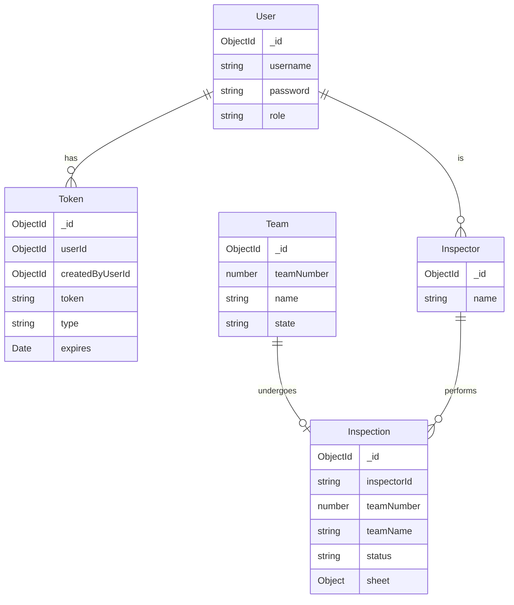

# R-Inspect Data Models

This document describes the core data models used in R-Inspect and their relationships.

## Model Relationships

## Models in Detail

### User

Represents users in the system with different access roles.

| Field | Type | Description |
|-------|------|-------------|
| `_id` | ObjectId | Unique identifier generated by MongoDB |
| `username` | String | Username for authentication (must be unique) |
| `password` | String | Hashed password (using bcrypt) |
| `role` | String | User role: 'inspector' or 'inspector_coordinator' |

**Notes:**
- Passwords are hashed using bcrypt before storage
- The `role` field determines the user's permissions in the system

### Token

Stores authentication tokens for stateless JWT-based authentication.

| Field | Type | Description |
|-------|------|-------------|
| `_id` | ObjectId | Unique identifier generated by MongoDB |
| `userId` | ObjectId | Reference to the user this token belongs to |
| `createdByUserId` | ObjectId | Reference to the user who created this token |
| `token` | String | The actual JWT token |
| `type` | String | Token type: 'access' or 'refresh' |
| `expires` | Date | Expiration timestamp |

**Notes:**
- Access tokens typically expire after 1 day
- Refresh tokens typically expire after 7 days
- Tokens are stored to enable invalidation (logout) functionality

### Team

Represents robotics teams participating in the tournament.

| Field | Type | Description |
|-------|------|-------------|
| `_id` | ObjectId | Unique identifier generated by MongoDB |
| `teamNumber` | Number | Unique team number (used as a natural key) |
| `name` | String | Team name |
| `state` | String | State/province/region of the team |

**Notes:**
- Team data is typically imported from the FIRST API before a tournament
- The `teamNumber` is used as the primary identifier for teams in the inspection process

### Inspector

Represents individuals responsible for performing inspections.

| Field | Type | Description |
|-------|------|-------------|
| `_id` | ObjectId | Unique identifier generated by MongoDB |
| `name` | String | Inspector's name (matches a user's username) |

**Notes:**
- Inspectors are associated with users who have the 'inspector' or 'inspector_coordinator' role
- An inspector record is created automatically when a user with appropriate role is created

### Inspection

Represents an inspection record for a team.

| Field | Type | Description |
|-------|------|-------------|
| `_id` | ObjectId | Unique identifier generated by MongoDB |
| `inspectorId` | String | ID of the inspector performing the inspection (null if not assigned) |
| `teamNumber` | Number | Team number being inspected |
| `teamName` | String | Name of the team being inspected |
| `status` | String | Current status of inspection: 'Not Started', 'In Progress', 'Complete', etc. |
| `sheet` | Object | JSON object containing the inspection sheet data |

**Notes:**
- The `sheet` field contains the detailed inspection data, which is managed by the frontend
- Each team has exactly one inspection record
- The `status` field is used to track the overall progress of inspections

## Status Values

The inspection `status` field can have the following values:

| Status | Description |
|--------|-------------|
| `Not Started` | Inspection has not yet begun |
| `In Progress` | Inspection is currently underway |
| `Complete` | Inspection has been completed successfully |
| `Issues Found` | Inspection identified issues that need to be addressed |
| `Re-inspection Required` | Team needs to be re-inspected after fixing issues |

## Schema Validation

The MongoDB schema includes validation rules to ensure data integrity. For example:

- Team numbers must be positive integers
- Status values must be one of the predefined options
- Required fields cannot be null or undefined

## Data Lifecycle

1. **Team Data** is imported first, typically before the tournament
2. **Inspection Records** are created for each team with status "Not Started"
3. As inspections progress, records are updated with inspector assignments, status changes, and sheet data
4. The system maintains a record of all inspections for reporting and analysis 