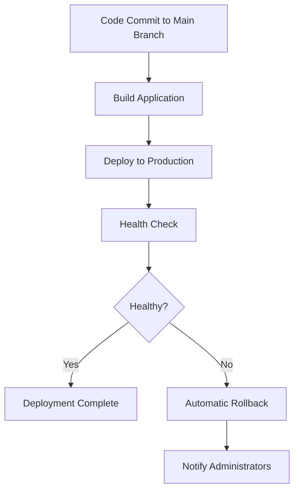

# R-Inspect Automated Deployment

The R-Inspect backend deployment is fully automated through a CI/CD pipeline maintained by [Silas Vergilio](https://github.com/silasvergilio).

## Deployment Pipeline Overview

## Deployment Process

The deployment process is triggered automatically when commits are pushed to the production branch. No manual intervention is required for standard deployments.

### Pipeline Steps

1. **Code Commit**: A developer pushes changes to the production branch
2. **Build Process**: The application is built and dependencies are installed
3. **Deployment**: The built application is deployed to the production environment
4. **Health Checks**: The system verifies the deployment is functioning correctly
5. **Notifications**: Team members are notified of successful or failed deployments

## Monitoring and Maintenance

Once deployed, the application is continually monitored for:

- Server health
- API response times
- Database performance
- Error rates

Any anomalies trigger alerts to the development team.

## Rollback Procedure

If issues are detected after deployment, the pipeline supports automatic rollbacks to the previous stable version. The system will:

1. Detect critical issues through health checks
2. Revert to the previous deployment
3. Notify administrators of the rollback
4. Preserve logs for debugging

## Deployment Schedule

- **Regular Deployments**: Scheduled during non-peak hours
- **Critical Fixes**: Deployed immediately after verification
- **Feature Releases**: Coordinated with tournament schedules

## For Developers

As a developer working on this project, you should:

1. Ensure your code is working properly before pushing
2. Follow the established branch strategy:
   - `development` for ongoing work
   - `staging` for pre-release validation
   - `main` for production deployment
3. Include thorough code review before merging
4. Document any changes that affect the deployment configuration

## Future Pipeline Enhancements

- Implement blue-green deployment strategy for zero-downtime updates
- Add automated testing framework
- Add automatic database migration steps in the deployment process
- Integrate security scanning tools (SAST/DAST) in the pipeline
- Add performance benchmarking before production deployment
- Implement canary deployments for high-risk features
- Set up a dedicated staging environment that mirrors production

## Contact Information

For questions about the deployment process or to report issues:

- **Pipeline Maintainer**: [Silas Vergilio](https://github.com/silasvergilio)
- **Deployment Status**: Check the project's CI/CD dashboard
- **Documentation**: Additional information is available in the team's internal knowledge base 