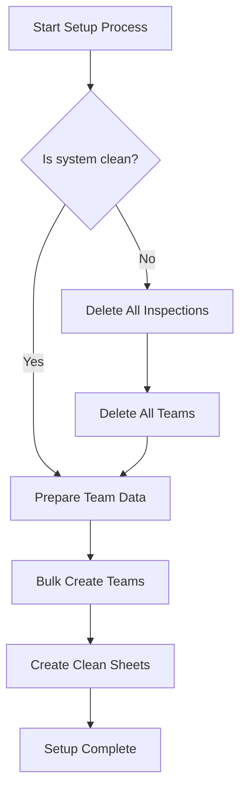
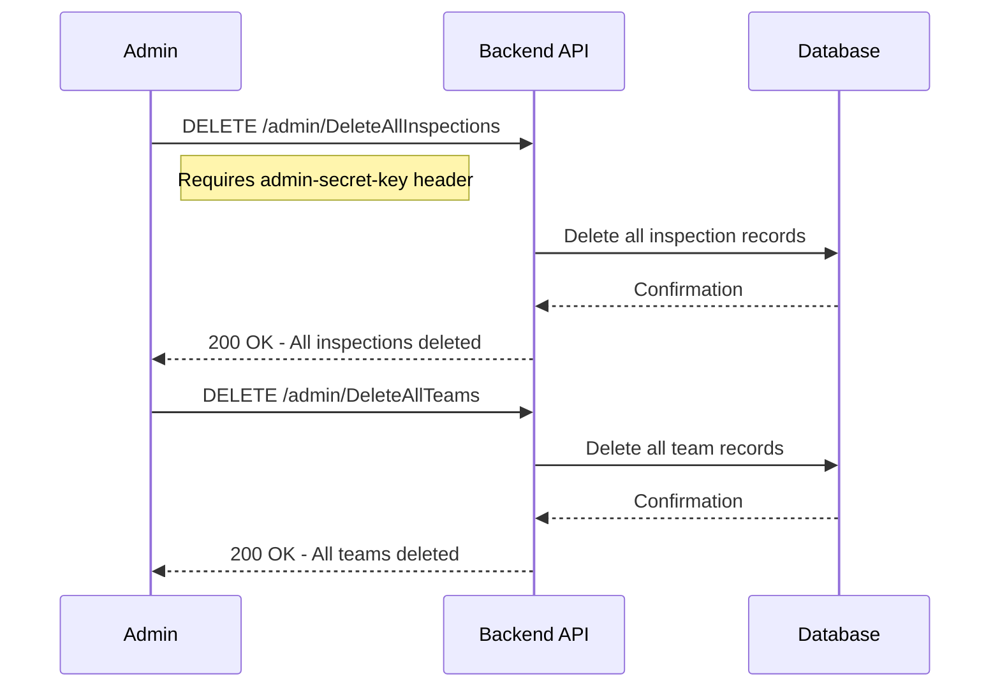
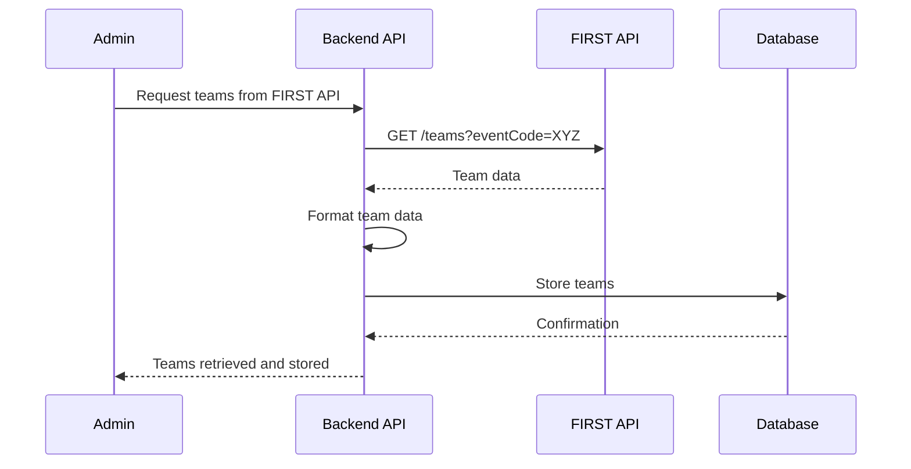
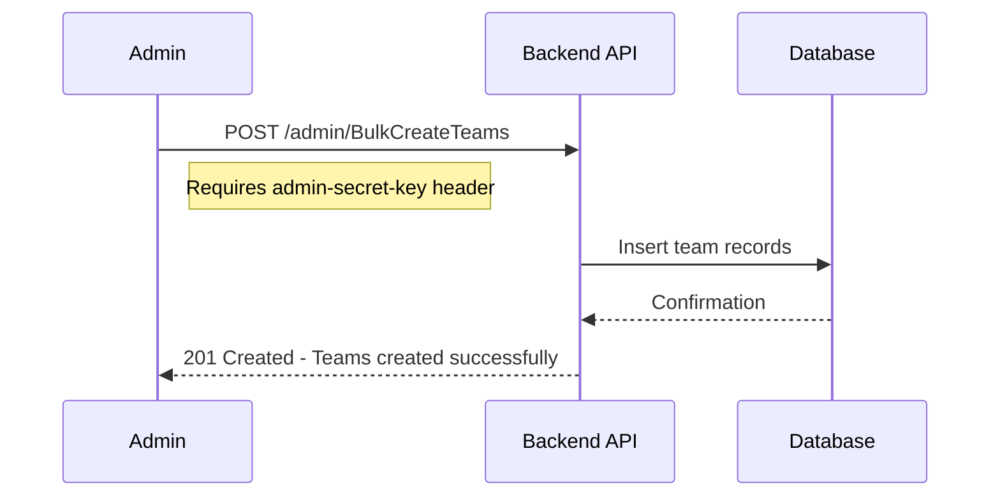
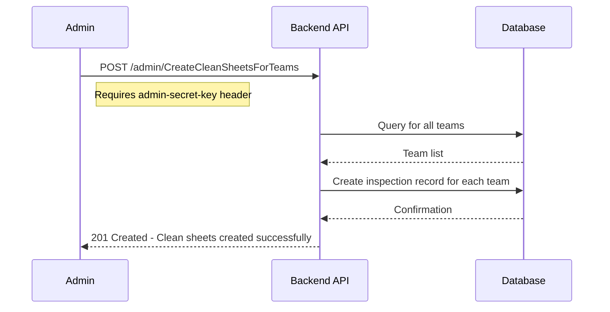

# R-Inspect Tournament Setup Guide

This document outlines the process for setting up the R-Inspect application for a new tournament. Follow these steps sequentially to ensure proper system initialization.

## Summary

The R-Inspect tournament setup process involves the following key steps:

1. **Clean the system** (if data from previous tournaments exists):
   - Delete all inspection records
   - Delete all team records

2. **Prepare team data** (manual preparation recommended):
   - Obtain team data from FIRST API
   - Format data according to required structure
   - Commit the data to the codebase to avoid runtime API dependencies

3. **Import teams into the database**:
   - Use the BulkCreateTeams endpoint to load all teams

4. **Create inspection sheets**:
   - Use the CreateCleanSheetsForTeams endpoint to initialize records for all teams

This setup should be performed by an administrator with the inspector_coordinator role. All admin endpoints require the admin-secret-key header for authentication.

## Prerequisites

- Node.js and npm installed
- Access to the MongoDB database
- Admin credentials with `inspector_coordinator` role
- FIRST API credentials (if fetching new team data)

## Database Setup Process Overview



## Detailed Setup Steps

### 1. System Cleanup (if necessary)

If the system contains data from previous tournaments, you must clean it before setting up a new tournament:



**Important:** Always delete inspections before deleting teams to maintain referential integrity.

### 2. Team Data Preparation

The system requires team data for the tournament. This should be prepared in advance and committed to the codebase to avoid runtime dependencies on the FIRST API.

#### Option A: Manually prepare team data (Recommended)

1. Obtain the list of teams for the event from the FIRST API
2. Format the data according to the required structure (see example below)
3. Add the formatted data to the `BulkCreateTeams` endpoint in `admin.js`
4. Commit this change to the codebase

```javascript
// Example team data structure
const teams = [
    {
        teamNumber: 123,
        name: "Team Name",
        state: "State"
    },
    // Additional teams...
];
```

#### Option B: Use the FIRST API directly (Not recommended for production)

The `teamsService.js` file contains functionality to fetch teams from the FIRST API, but this should only be used for development or testing purposes.



### 3. Create Teams in Database

Once the team data is prepared, use the `BulkCreateTeams` endpoint to add all teams to the database:



### 4. Create Inspection Sheets

After teams are created, initialize the inspection sheets for all teams:



**Note:** This process creates inspection records without detailed sheet data. The sheet logic is managed by the frontend application.

## API Endpoints Reference

Here's a summary of the admin endpoints used in the setup process:

| Endpoint | Method | Purpose | Required Headers |
|----------|--------|---------|-----------------|
| `/admin/DeleteAllInspections` | DELETE | Remove all inspection records | admin-secret-key |
| `/admin/DeleteAllTeams` | DELETE | Remove all team records | admin-secret-key |
| `/admin/BulkCreateTeams` | POST | Create multiple teams | admin-secret-key |
| `/admin/CreateCleanSheetsForTeams` | POST | Initialize inspection sheets | admin-secret-key |

## Important Notes

1. **Offline Operation:** By preparing team data in advance and committing it to the codebase, the application does not depend on the FIRST API during tournament operations.

2. **Order of Operations:** Always follow the prescribed order:
   - Clean the system (if needed)
   - Create teams
   - Create inspection sheets

3. **Security:** All admin endpoints require the `admin-secret-key` header and appropriate role-based authorization.

4. **User Management:** Use the `/admin/user` endpoints to manage inspectors and coordinator accounts.

## Future Setup Improvements

- Automate team data retrieval and formatting from FIRST API
- Develop a scripted setup process for consistent deployment
- Create an admin dashboard for one-click tournament initialization
- Add data validation between setup stages
